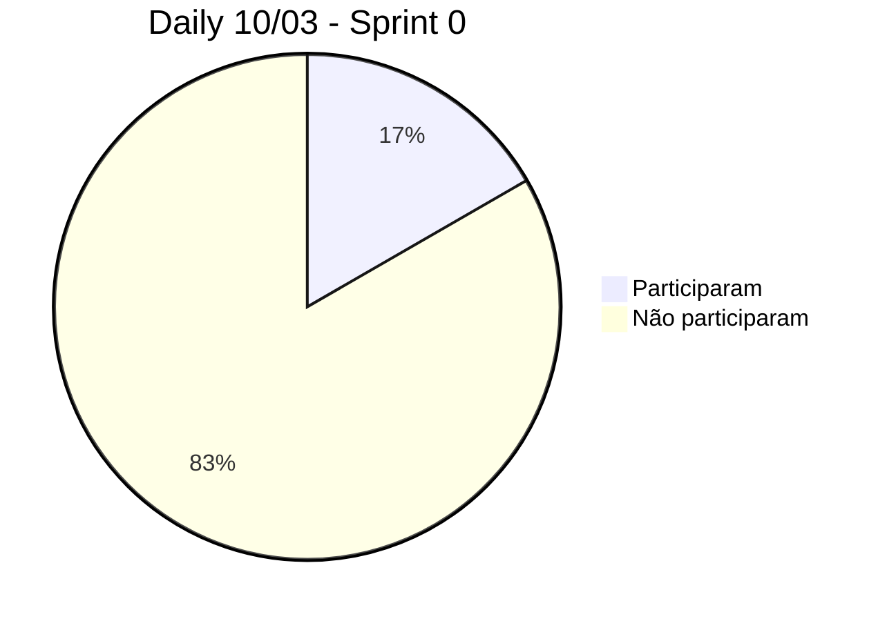

|[Home](home)|[Sprints](sprints)|[Requisitos](requisitos)|[Arquitetura](arquitetura)|[Processos](processos)|[Configuração](configuracao)|[Mockups](mockups)|[Banco de Dados](banco_dados)|[Instalação](instalacao)|[Gerência de Projeto](Gerenciamento do Projeto)|[Horários Disponiveis](horarios)|
|---|---|---|---|---|---|---|---|---|---|---|

---
# $`\mathbb{CONTROLE \space DE \space SPRINTS}`$
---

## Cronograma

### Sprint 0

- Começo: 08/03/2023 
- Fim: 27/03/2023
- Apresentação para os Stakeholders: $`\color{red}\bold{22/03/2023}`$

### Sprint 1

- Começo: 29/03/2023
- Fim: 12/04/2023
- Apresentação para os Stakeholders: $`\color{red}\bold{10/04/2023}`$

### Sprint 2

- Começo: 19/04/2023
- Fim: 10/05/2023
- Apresentação para o Stakeholders: $`\color{red}\bold{08/05/2023}`$

### Sprint 3

- Começo: 15/05/2023
- Fim: 29/05/2023
- Apresentação para os Stakeholders: $`\color{red}\bold{24/05/2023}`$

### Sprint 4

- Começo: 31/05/2023
- Fim: 14/06/2023
- Apresentação para os Stakeholders: $`\color{red}\bold{14/06/2023}`$

## Controle das Dailys de sextas feiras

### Sprint 0

