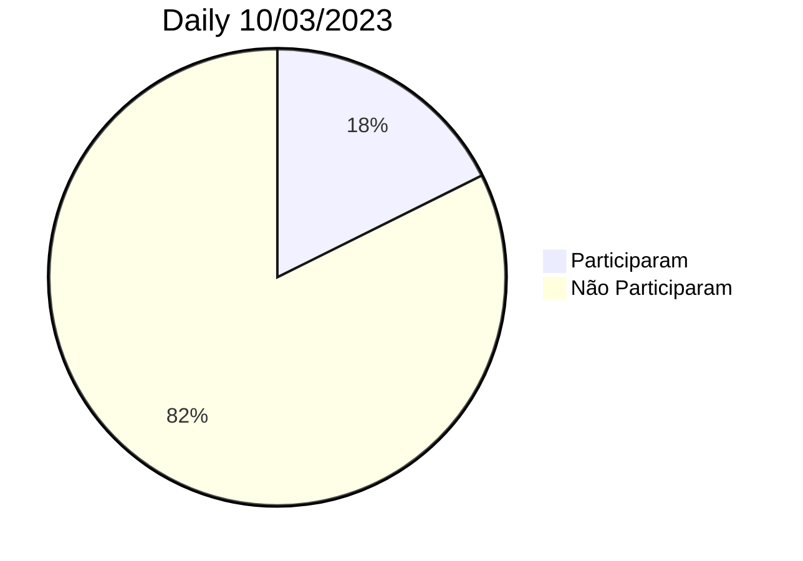

|[Home](home)|[Sprints](sprints)|[Requisitos](requisitos)|[Arquitetura](arquitetura)|[Processos](processos)|[Configuração](configuracao)|[Mockups](mockups)|[Banco de Dados](banco_dados)|[Instalação](instalacao)|[Gerência de Projeto](Gerenciamento do Projeto)|[Horários Disponiveis](horarios)|
|---|---|---|---|---|---|---|---|---|---|---|

---
$$\mathbb{CONTROLE \space DE \space SPRINTS}$$
---

## Sprint 0

- Começo:  
- Fim:

**Squads** = As Squads foram definidas mas não usadas nessa Sprint, foi feito os Mockups e elaborado a Infraestrutura do projeto.

**Participações nas Dailys de Sexta** = Como foi algo novo, muitos não sabiam da existencia por falta de comunicação, mas aqui um resumo:

## Sprint 1

- Começo: 
- Fim: 

## Sprint 2

- Começo: 
- Fim: 

## Sprint 3

- Começo: 
- Fim: 

## Sprint 4

- Começo: 
- Fim: 