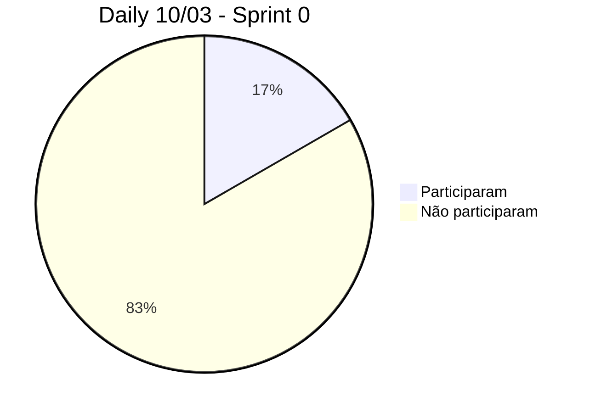
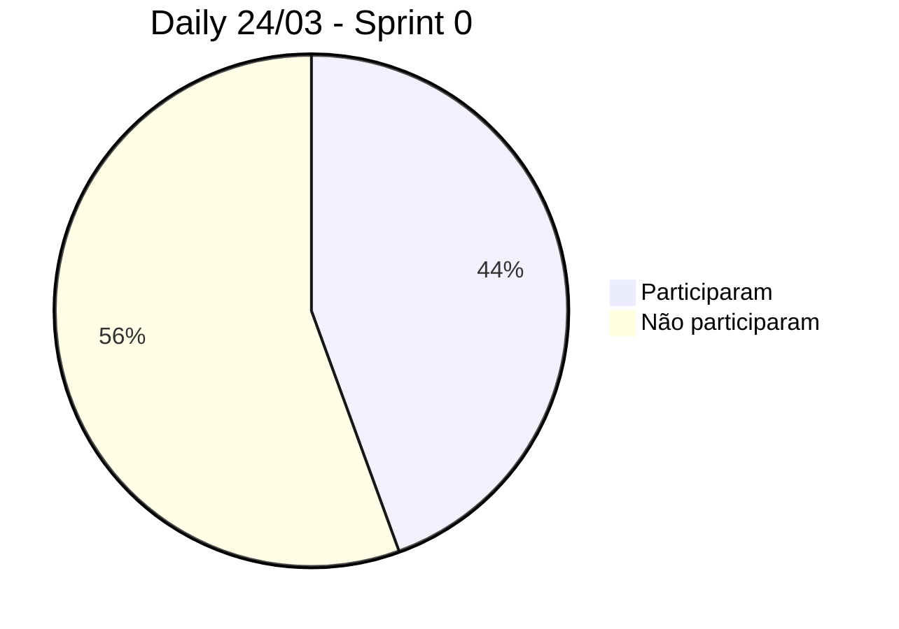
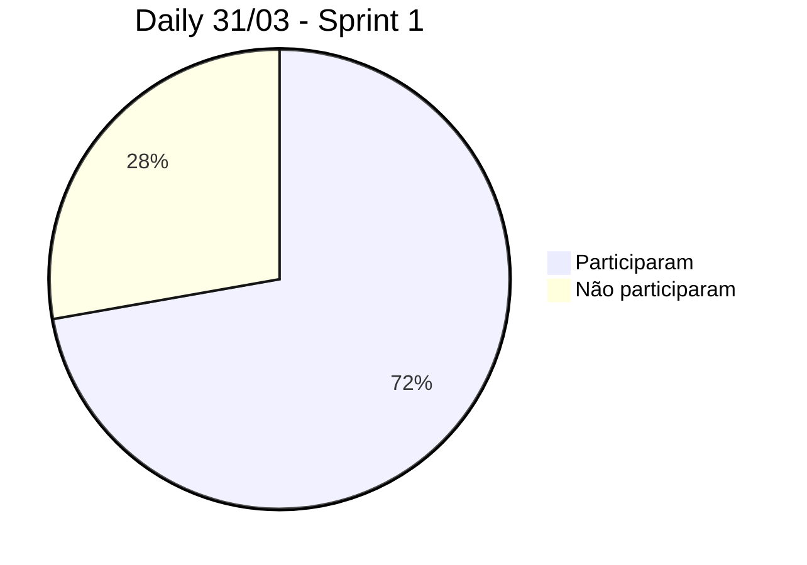
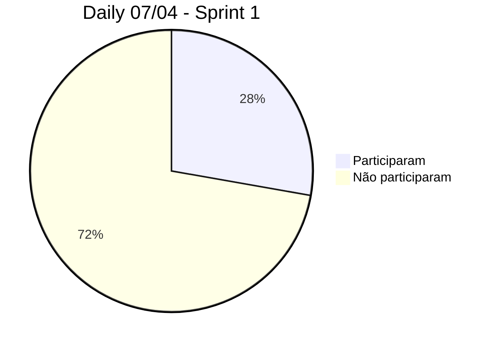
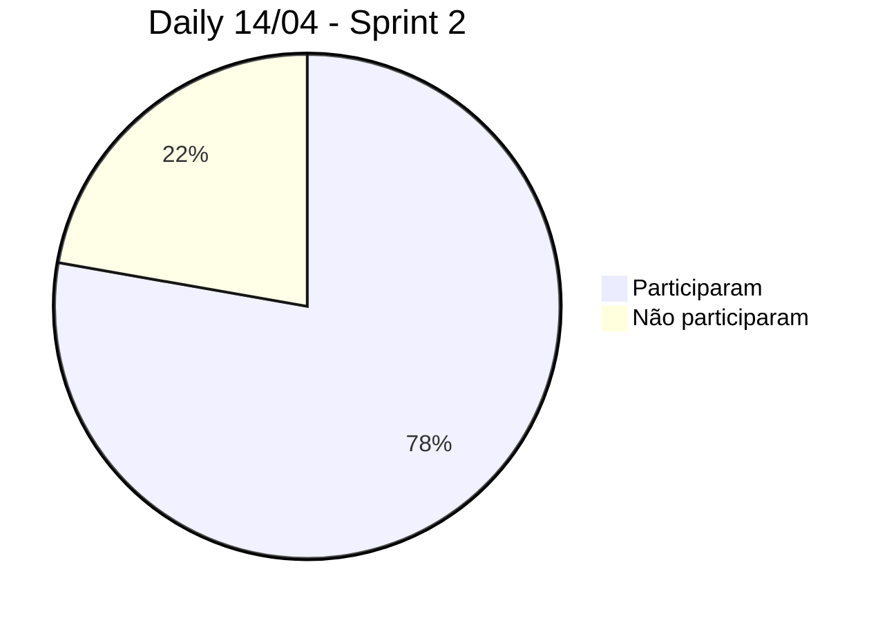
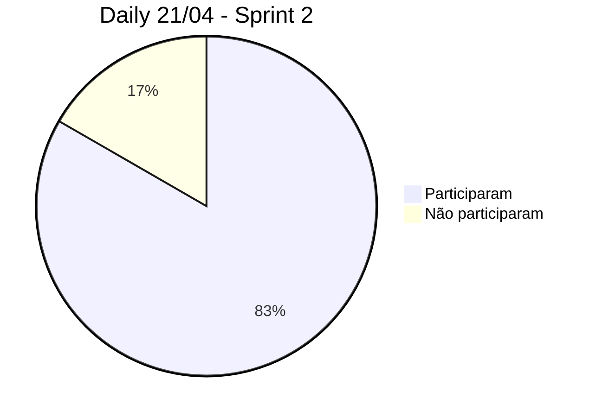

# Documentação do negócio

# Documentação técnica

---
# $`\mathbb{CONTROLE \space DE \space SPRINTS}`$
---

- [Cronograma](#cronograma)
    - [Sprint 0](#sprint-0)
    - [Sprint 1](#sprint-1)
    - [Sprint 2](#sprint-2)
    - [Sprint 3](#sprint-3)
    - [Sprint 4](#sprint-4)
- [Controle das Dailys de sextas feiras](#controle-das-dailys-de-sextas-feiras)
    - [Sprint 0](#daily-sprint-0)
    - [Sprint 1](#daily-sprint-1)
    - [Sprint 2](#daily-sprint-2)

---

## Cronograma

### Sprint 0

- Começo: 08/03/2023 
- Fim: 27/03/2023
- Apresentação para os Stakeholders: $`\color{red}\bold{22/03/2023}`$

### Sprint 1

- Começo: 29/03/2023
- Fim: 12/04/2023
- Apresentação para os Stakeholders: $`\color{red}\bold{10/04/2023}`$

### Sprint 2

- Começo: 19/04/2023
- Fim: 10/05/2023
- Apresentação para o Stakeholders: $`\color{red}\bold{08/05/2023}`$

### Sprint 3

- Começo: 15/05/2023
- Fim: 29/05/2023
- Apresentação para os Stakeholders: $`\color{red}\bold{24/05/2023}`$

### Sprint 4

- Começo: 31/05/2023
- Fim: 14/06/2023
- Apresentação para os Stakeholders: $`\color{red}\bold{14/06/2023}`$

## Controle das Dailys de sextas feiras

### Daily Sprint 0

### Daily Sprint 1

### Daily Sprint 2

