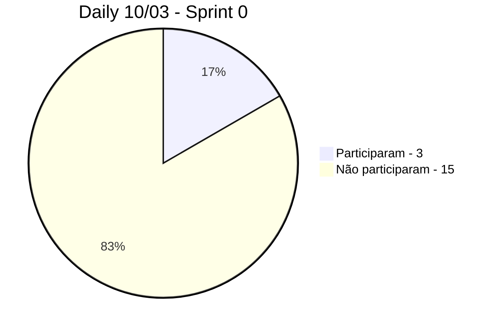
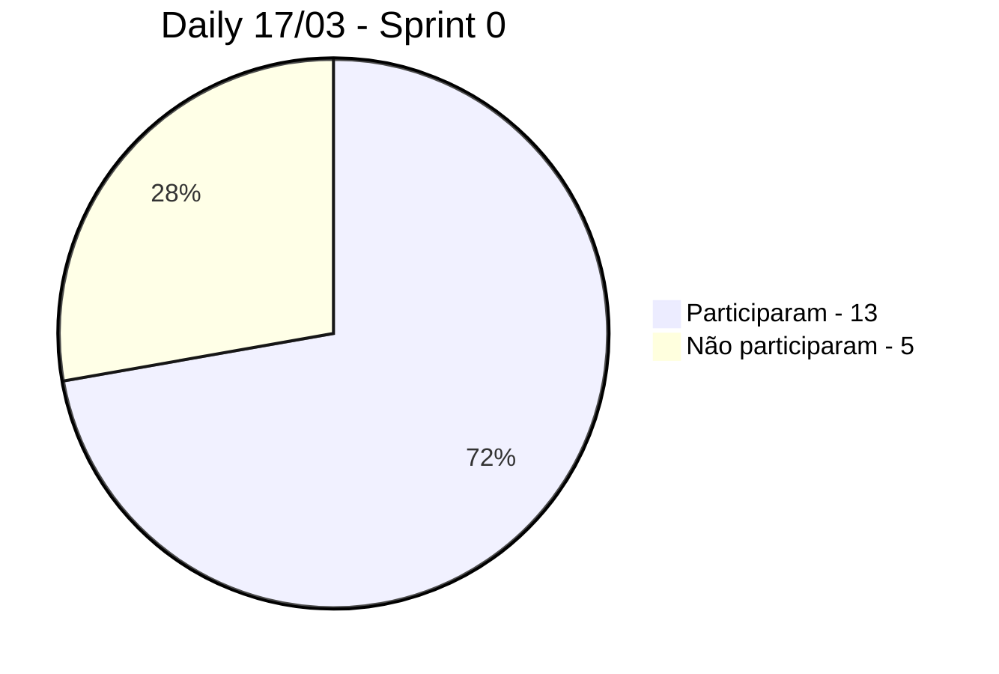
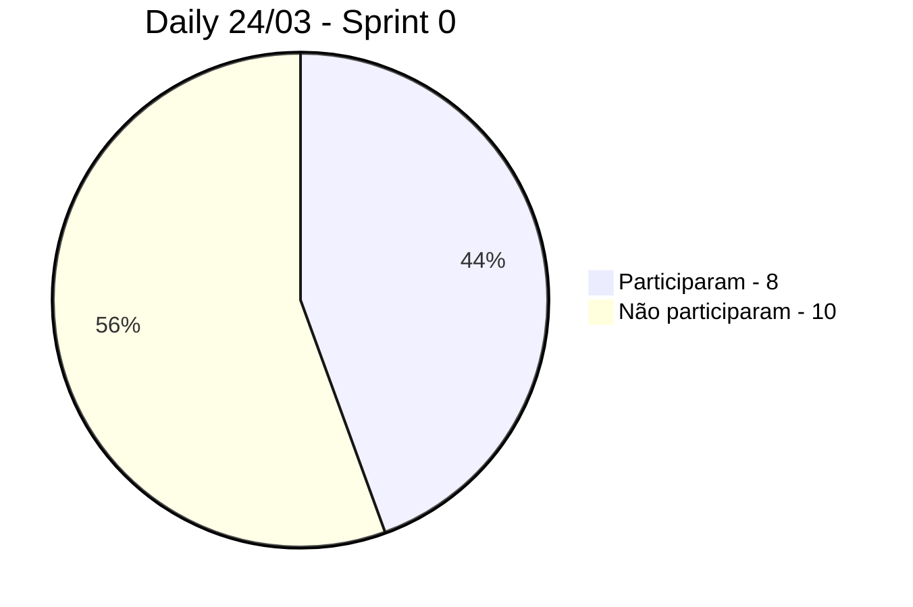
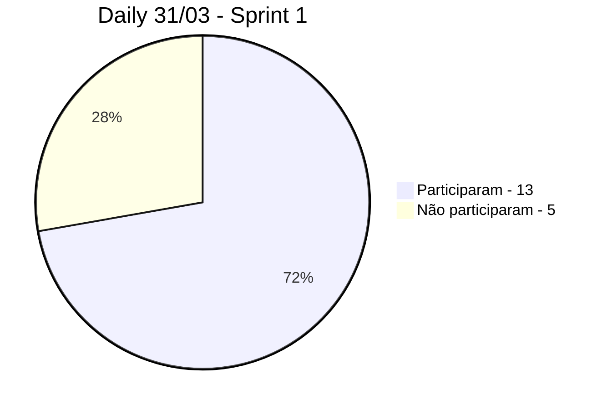
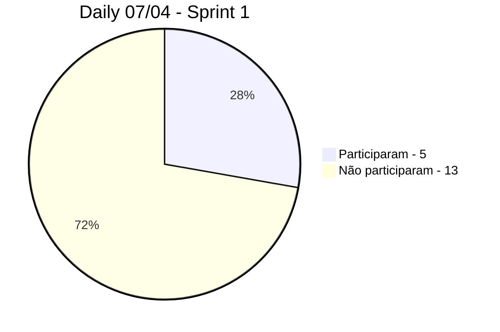
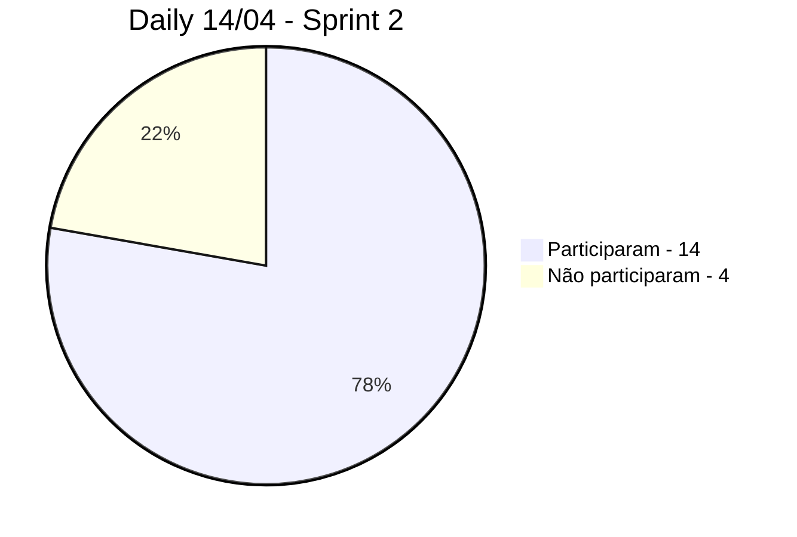
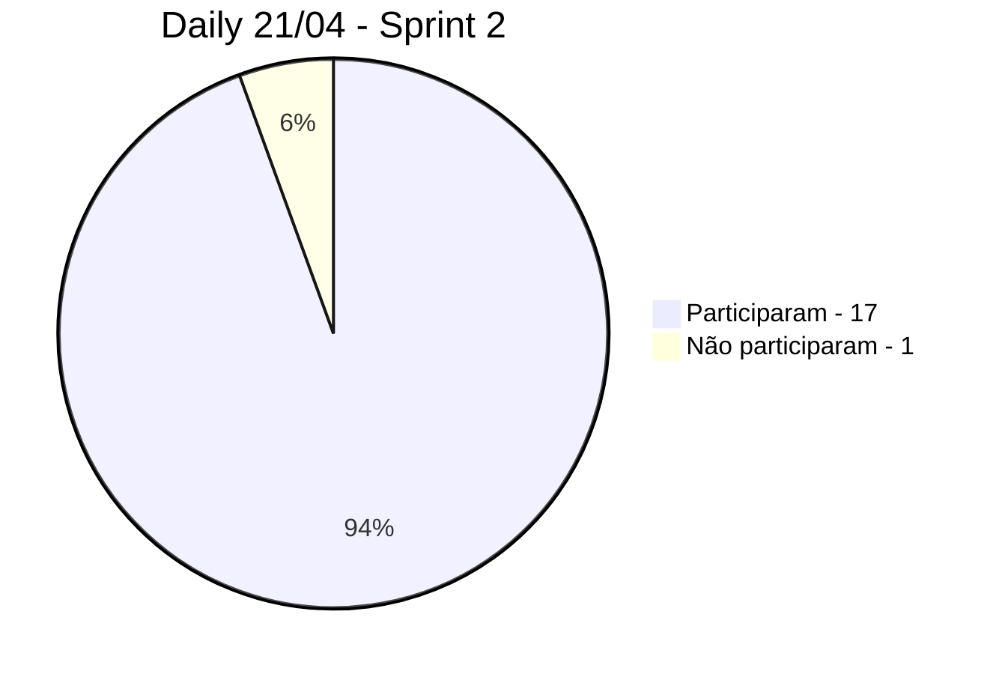
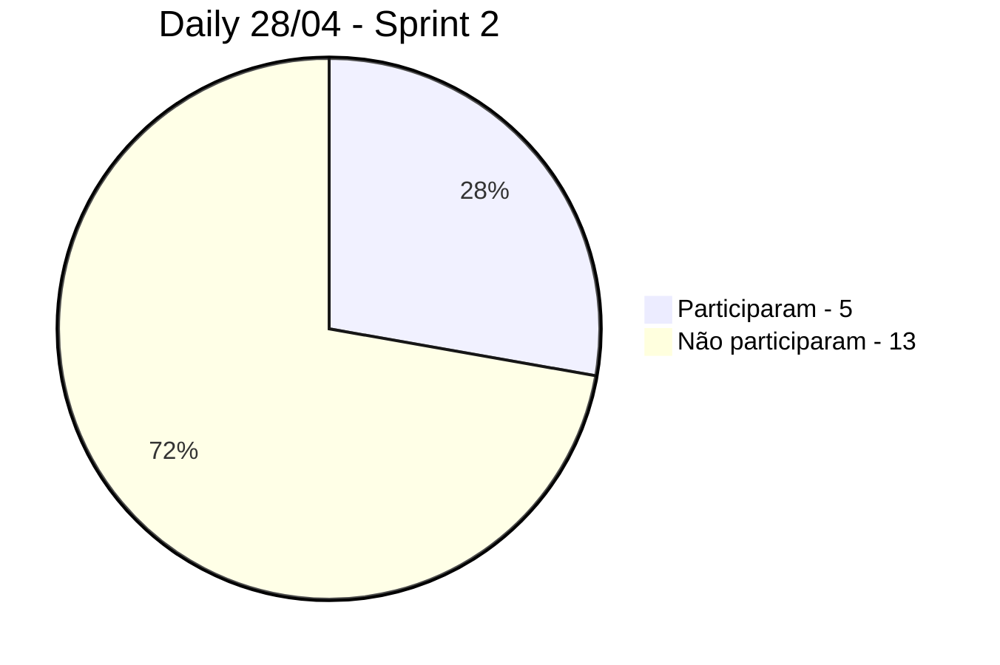

# Documentação do negócio

# Documentação técnica

---
# $`\mathbb{CONTROLE \space DE \space SPRINTS}`$
---

- [Cronograma](#cronograma)
    - [Sprint 0](#sprint-0)
    - [Sprint 1](#sprint-1)
    - [Sprint 2](#sprint-2)
    - [Sprint 3](#sprint-3)
    - [Sprint 4](#sprint-4)
- [Controle das Dailys de sextas feiras](#controle-das-dailys-de-sextas-feiras)
    - [Sprint 0](#daily-sprint-0)
    - [Sprint 1](#daily-sprint-1)
    - [Sprint 2](#daily-sprint-2)

---

## Cronograma

### Sprint 0

- Começo: 08/03/2023 
- Fim: 27/03/2023
- Apresentação para os Stakeholders: $`\color{red}\bold{22/03/2023}`$

### Sprint 1

- Começo: 29/03/2023
- Fim: 12/04/2023
- Apresentação para os Stakeholders: $`\color{red}\bold{10/04/2023}`$

### Sprint 2

- Começo: 19/04/2023
- Fim: 10/05/2023
- Apresentação para o Stakeholders: $`\color{red}\bold{08/05/2023}`$

### Sprint 3

- Começo: 15/05/2023
- Fim: 29/05/2023
- Apresentação para os Stakeholders: $`\color{red}\bold{24/05/2023}`$

### Sprint 4

- Começo: 31/05/2023
- Fim: 14/06/2023
- Apresentação para os Stakeholders: $`\color{red}\bold{14/06/2023}`$

## Controle das Dailys de sextas feiras

### Sprint 0

Daily 10/03/2023

<h3>Participantes</h3>
<table>
  <tr>
    <th>Nome</th>
    <th>Nível</th>
    <th>Presença</th>
  </tr>
  <tr>
    <td>Brenda Pereira</td>
    <td>AGES I</td>
    <td>❌</td>
  </tr>
  <tr>
    <td>Carolina Ferreira</td>
    <td>AGES I</td>
    <td>❌</td>
  </tr>
  <tr>
    <td>Davi Oliveira</td>
    <td>AGES I</td>
    <td>❌</td>
  </tr>
  <tr>
    <td>Felipe Freitas</td>
    <td>AGES I</td>
    <td>✅</td>
  </tr>
  <tr>
    <td>Gabriel Giaretta</td>
    <td>AGES I</td>
    <td>❌</td>
  </tr>
  <tr>
    <td>Gabriel Ferreira</td>
    <td>AGES I</td>
    <td>❌</td>
  </tr>
  <tr>
    <td>Guilherme de Moraes</td>
    <td>AGES I</td>
    <td>❌</td>
  </tr>
  <tr>
    <td>Matheus Caçabuena</td>
    <td>AGES I</td>
    <td>❌</td>
  </tr>
  <tr>
    <td>Arthur Mariano</td>
    <td>AGES II</td>
    <td>❌</td>
  </tr>
  <tr>
    <td>Israel Garcia</td>
    <td>AGES II</td>
    <td>❌</td>
  </tr>
  <tr>
    <td>Marcello Marcon</td>
    <td>AGES II</td>
    <td>❌</td>
  </tr>
  <tr>
    <td>Pedro Carlucci</td>
    <td>AGES II</td>
    <td>❌</td>
  </tr>
  <tr>
    <td>Arthur Ibarra</td>
    <td>AGES III</td>
    <td>❌</td>
  </tr>
  <tr>
    <td>Kevin Ribas</td>
    <td>AGES III</td>
    <td>✅</td>
  </tr>
  <tr>
    <td>Lucas Susin</td>
    <td>AGES III</td>
    <td>❌</td>
  </tr>
  <tr>
    <td>David Bertrand</td>
    <td>AGES IV</td>
    <td>❌</td>
  </tr>
  <tr>
    <td>Gabriel Fanto</td>
    <td>AGES IV</td>
    <td>✅</td>
  </tr>
  <tr>
    <td>Luiz Eduardo</td>
    <td>AGES IV</td>
    <td>❌</td>
  </tr>
</table>

Daily 17/03/2023

<h3>Participantes</h3>
<table>
  <tr>
    <th>Nome</th>
    <th>Nível</th>
    <th>Presença</th>
  </tr>
  <tr>
    <td>Brenda Pereira</td>
    <td>AGES I</td>
    <td>✅</td>
  </tr>
  <tr>
    <td>Carolina Ferreira</td>
    <td>AGES I</td>
    <td>❌</td>
  </tr>
  <tr>
    <td>Davi Oliveira</td>
    <td>AGES I</td>
    <td>✅</td>
  </tr>
  <tr>
    <td>Felipe Freitas</td>
    <td>AGES I</td>
    <td>✅</td>
  </tr>
  <tr>
    <td>Gabriel Giaretta</td>
    <td>AGES I</td>
    <td>❌</td>
  </tr>
  <tr>
    <td>Gabriel Ferreira</td>
    <td>AGES I</td>
    <td>✅</td>
  </tr>
  <tr>
    <td>Guilherme de Moraes</td>
    <td>AGES I</td>
    <td>✅</td>
  </tr>
  <tr>
    <td>Matheus Caçabuena</td>
    <td>AGES I</td>
    <td>✅</td>
  </tr>
  <tr>
    <td>Arthur Mariano</td>
    <td>AGES II</td>
    <td>❌</td>
  </tr>
  <tr>
    <td>Israel Garcia</td>
    <td>AGES II</td>
    <td>❌</td>
  </tr>
  <tr>
    <td>Marcello Marcon</td>
    <td>AGES II</td>
    <td>❌</td>
  </tr>
  <tr>
    <td>Pedro Carlucci</td>
    <td>AGES II</td>
    <td>✅</td>
  </tr>
  <tr>
    <td>Arthur Ibarra</td>
    <td>AGES III</td>
    <td>✅</td>
  </tr>
  <tr>
    <td>Kevin Ribas</td>
    <td>AGES III</td>
    <td>✅</td>
  </tr>
  <tr>
    <td>Lucas Susin</td>
    <td>AGES III</td>
    <td>✅</td>
  </tr>
  <tr>
    <td>David Bertrand</td>
    <td>AGES IV</td>
    <td>✅</td>
  </tr>
  <tr>
    <td>Gabriel Fanto</td>
    <td>AGES IV</td>
    <td>✅</td>
  </tr>
  <tr>
    <td>Luiz Eduardo</td>
    <td>AGES IV</td>
    <td>✅</td>
  </tr>
</table>

Daily 24/03/2023

<h3>Participantes</h3>
<table>
  <tr>
    <th>Nome</th>
    <th>Nível</th>
    <th>Presença</th>
  </tr>
  <tr>
    <td>Brenda Pereira</td>
    <td>AGES I</td>
    <td>✅</td>
  </tr>
  <tr>
    <td>Carolina Ferreira</td>
    <td>AGES I</td>
    <td>❌</td>
  </tr>
  <tr>
    <td>Davi Oliveira</td>
    <td>AGES I</td>
    <td>❌</td>
  </tr>
  <tr>
    <td>Felipe Freitas</td>
    <td>AGES I</td>
    <td>✅</td>
  </tr>
  <tr>
    <td>Gabriel Giaretta</td>
    <td>AGES I</td>
    <td>❌</td>
  </tr>
  <tr>
    <td>Gabriel Ferreira</td>
    <td>AGES I</td>
    <td>❌</td>
  </tr>
  <tr>
    <td>Guilherme de Moraes</td>
    <td>AGES I</td>
    <td>✅</td>
  </tr>
  <tr>
    <td>Matheus Caçabuena</td>
    <td>AGES I</td>
    <td>❌</td>
  </tr>
  <tr>
    <td>Arthur Mariano</td>
    <td>AGES II</td>
    <td>❌</td>
  </tr>
  <tr>
    <td>Israel Garcia</td>
    <td>AGES II</td>
    <td>❌</td>
  </tr>
  <tr>
    <td>Marcello Marcon</td>
    <td>AGES II</td>
    <td>❌</td>
  </tr>
  <tr>
    <td>Pedro Carlucci</td>
    <td>AGES II</td>
    <td>✅</td>
  </tr>
  <tr>
    <td>Arthur Ibarra</td>
    <td>AGES III</td>
    <td>✅</td>
  </tr>
  <tr>
    <td>Kevin Ribas</td>
    <td>AGES III</td>
    <td>❌</td>
  </tr>
  <tr>
    <td>Lucas Susin</td>
    <td>AGES III</td>
    <td>✅</td>
  </tr>
  <tr>
    <td>David Bertrand</td>
    <td>AGES IV</td>
    <td>✅</td>
  </tr>
  <tr>
    <td>Gabriel Fanto</td>
    <td>AGES IV</td>
    <td>✅</td>
  </tr>
  <tr>
    <td>Luiz Eduardo</td>
    <td>AGES IV</td>
    <td>❌</td>
  </tr>
</table>

### Sprint 1

Daily 31/03/2023

<h3>Participantes</h3>
<table>
  <tr>
    <th>Nome</th>
    <th>Nível</th>
    <th>Presença</th>
  </tr>
  <tr>
    <td>Brenda Pereira</td>
    <td>AGES I</td>
    <td>✅</td>
  </tr>
  <tr>
    <td>Carolina Ferreira</td>
    <td>AGES I</td>
    <td>✅</td>
  </tr>
  <tr>
    <td>Davi Oliveira</td>
    <td>AGES I</td>
    <td>✅</td>
  </tr>
  <tr>
    <td>Felipe Freitas</td>
    <td>AGES I</td>
    <td>✅</td>
  </tr>
  <tr>
    <td>Gabriel Giaretta</td>
    <td>AGES I</td>
    <td>❌</td>
  </tr>
  <tr>
    <td>Gabriel Ferreira</td>
    <td>AGES I</td>
    <td>✅</td>
  </tr>
  <tr>
    <td>Guilherme de Moraes</td>
    <td>AGES I</td>
    <td>✅</td>
  </tr>
  <tr>
    <td>Matheus Caçabuena</td>
    <td>AGES I</td>
    <td>✅</td>
  </tr>
  <tr>
    <td>Arthur Mariano</td>
    <td>AGES II</td>
    <td>❌</td>
  </tr>
  <tr>
    <td>Israel Garcia</td>
    <td>AGES II</td>
    <td>✅</td>
  </tr>
  <tr>
    <td>Marcello Marcon</td>
    <td>AGES II</td>
    <td>❌</td>
  </tr>
  <tr>
    <td>Pedro Carlucci</td>
    <td>AGES II</td>
    <td>✅</td>
  </tr>
  <tr>
    <td>Arthur Ibarra</td>
    <td>AGES III</td>
    <td>❌</td>
  </tr>
  <tr>
    <td>Kevin Ribas</td>
    <td>AGES III</td>
    <td>❌</td>
  </tr>
  <tr>
    <td>Lucas Susin</td>
    <td>AGES III</td>
    <td>✅</td>
  </tr>
  <tr>
    <td>David Bertrand</td>
    <td>AGES IV</td>
    <td>✅</td>
  </tr>
  <tr>
    <td>Gabriel Fanto</td>
    <td>AGES IV</td>
    <td>✅</td>
  </tr>
  <tr>
    <td>Luiz Eduardo</td>
    <td>AGES IV</td>
    <td>✅</td>
  </tr>
</table>

Daily 07/04/2023

<h3>Participantes</h3>
<table>
  <tr>
    <th>Nome</th>
    <th>Nível</th>
    <th>Presença</th>
  </tr>
  <tr>
    <td>Brenda Pereira</td>
    <td>AGES I</td>
    <td>❌</td>
  </tr>
  <tr>
    <td>Carolina Ferreira</td>
    <td>AGES I</td>
    <td>❌</td>
  </tr>
  <tr>
    <td>Davi Oliveira</td>
    <td>AGES I</td>
    <td>❌</td>
  </tr>
  <tr>
    <td>Felipe Freitas</td>
    <td>AGES I</td>
    <td>✅</td>
  </tr>
  <tr>
    <td>Gabriel Giaretta</td>
    <td>AGES I</td>
    <td>✅</td>
  </tr>
  <tr>
    <td>Gabriel Ferreira</td>
    <td>AGES I</td>
    <td>❌</td>
  </tr>
  <tr>
    <td>Guilherme de Moraes</td>
    <td>AGES I</td>
    <td>❌</td>
  </tr>
  <tr>
    <td>Matheus Caçabuena</td>
    <td>AGES I</td>
    <td>✅</td>
  </tr>
  <tr>
    <td>Arthur Mariano</td>
    <td>AGES II</td>
    <td>❌</td>
  </tr>
  <tr>
    <td>Israel Garcia</td>
    <td>AGES II</td>
    <td>❌</td>
  </tr>
  <tr>
    <td>Marcello Marcon</td>
    <td>AGES II</td>
    <td>❌</td>
  </tr>
  <tr>
    <td>Pedro Carlucci</td>
    <td>AGES II</td>
    <td>❌</td>
  </tr>
  <tr>
    <td>Arthur Ibarra</td>
    <td>AGES III</td>
    <td>✅</td>
  </tr>
  <tr>
    <td>Kevin Ribas</td>
    <td>AGES III</td>
    <td>❌</td>
  </tr>
  <tr>
    <td>Lucas Susin</td>
    <td>AGES III</td>
    <td>❌</td>
  </tr>
  <tr>
    <td>David Bertrand</td>
    <td>AGES IV</td>
    <td>❌</td>
  </tr>
  <tr>
    <td>Gabriel Fanto</td>
    <td>AGES IV</td>
    <td>✅</td>
  </tr>
  <tr>
    <td>Luiz Eduardo</td>
    <td>AGES IV</td>
    <td>❌</td>
  </tr>
</table>

### Sprint 2

Daily 14/04/2023

<h3>Participantes</h3>
<table>
  <tr>
    <th>Nome</th>
    <th>Nível</th>
    <th>Presença</th>
  </tr>
  <tr>
    <td>Brenda Pereira</td>
    <td>AGES I</td>
    <td>❌</td>
  </tr>
  <tr>
    <td>Carolina Ferreira</td>
    <td>AGES I</td>
    <td>✅</td>
  </tr>
  <tr>
    <td>Davi Oliveira</td>
    <td>AGES I</td>
    <td>❌</td>
  </tr>
  <tr>
    <td>Felipe Freitas</td>
    <td>AGES I</td>
    <td>✅</td>
  </tr>
  <tr>
    <td>Gabriel Giaretta</td>
    <td>AGES I</td>
    <td>✅</td>
  </tr>
  <tr>
    <td>Gabriel Ferreira</td>
    <td>AGES I</td>
    <td>✅</td>
  </tr>
  <tr>
    <td>Guilherme de Moraes</td>
    <td>AGES I</td>
    <td>✅</td>
  </tr>
  <tr>
    <td>Matheus Caçabuena</td>
    <td>AGES I</td>
    <td>✅</td>
  </tr>
  <tr>
    <td>Arthur Mariano</td>
    <td>AGES II</td>
    <td>❌</td>
  </tr>
  <tr>
    <td>Israel Garcia</td>
    <td>AGES II</td>
    <td>❌</td>
  </tr>
  <tr>
    <td>Marcello Marcon</td>
    <td>AGES II</td>
    <td>✅</td>
  </tr>
  <tr>
    <td>Pedro Carlucci</td>
    <td>AGES II</td>
    <td>✅</td>
  </tr>
  <tr>
    <td>Arthur Ibarra</td>
    <td>AGES III</td>
    <td>✅</td>
  </tr>
  <tr>
    <td>Kevin Ribas</td>
    <td>AGES III</td>
    <td>✅</td>
  </tr>
  <tr>
    <td>Lucas Susin</td>
    <td>AGES III</td>
    <td>✅</td>
  </tr>
  <tr>
    <td>David Bertrand</td>
    <td>AGES IV</td>
    <td>✅</td>
  </tr>
  <tr>
    <td>Gabriel Fanto</td>
    <td>AGES IV</td>
    <td>❌</td>
  </tr>
  <tr>
    <td>Luiz Eduardo</td>
    <td>AGES IV</td>
    <td>✅</td>
  </tr>
</table>

Daily 21/04/2023

<h3>Participantes</h3>
<table>
  <tr>
    <th>Nome</th>
    <th>Nível</th>
    <th>Presença</th>
  </tr>
  <tr>
    <td>Brenda Pereira</td>
    <td>AGES I</td>
    <td>✅</td>
  </tr>
  <tr>
    <td>Carolina Ferreira</td>
    <td>AGES I</td>
    <td>✅</td>
  </tr>
  <tr>
    <td>Davi Oliveira</td>
    <td>AGES I</td>
    <td>✅</td>
  </tr>
  <tr>
    <td>Felipe Freitas</td>
    <td>AGES I</td>
    <td>✅</td>
  </tr>
  <tr>
    <td>Gabriel Giaretta</td>
    <td>AGES I</td>
    <td>✅</td>
  </tr>
  <tr>
    <td>Gabriel Ferreira</td>
    <td>AGES I</td>
    <td>✅</td>
  </tr>
  <tr>
    <td>Guilherme de Moraes</td>
    <td>AGES I</td>
    <td>✅</td>
  </tr>
  <tr>
    <td>Matheus Caçabuena</td>
    <td>AGES I</td>
    <td>✅</td>
  </tr>
  <tr>
    <td>Arthur Mariano</td>
    <td>AGES II</td>
    <td>❌</td>
  </tr>
  <tr>
    <td>Israel Garcia</td>
    <td>AGES II</td>
    <td>✅</td>
  </tr>
  <tr>
    <td>Marcello Marcon</td>
    <td>AGES II</td>
    <td>✅</td>
  </tr>
  <tr>
    <td>Pedro Carlucci</td>
    <td>AGES II</td>
    <td>✅</td>
  </tr>
  <tr>
    <td>Arthur Ibarra</td>
    <td>AGES III</td>
    <td>✅</td>
  </tr>
  <tr>
    <td>Kevin Ribas</td>
    <td>AGES III</td>
    <td>✅</td>
  </tr>
  <tr>
    <td>Lucas Susin</td>
    <td>AGES III</td>
    <td>✅</td>
  </tr>
  <tr>
    <td>David Bertrand</td>
    <td>AGES IV</td>
    <td>✅</td>
  </tr>
  <tr>
    <td>Gabriel Fanto</td>
    <td>AGES IV</td>
    <td>✅</td>
  </tr>
  <tr>
    <td>Luiz Eduardo</td>
    <td>AGES IV</td>
    <td>✅</td>
  </tr>
</table>

Daily 28/04/2023

<h3>Participantes</h3>
<table>
  <tr>
    <th>Nome</th>
    <th>Nível</th>
    <th>Presença</th>
  </tr>
  <tr>
    <td>Brenda Pereira</td>
    <td>AGES I</td>
    <td>✅</td>
  </tr>
  <tr>
    <td>Carolina Ferreira</td>
    <td>AGES I</td>
    <td>❌</td>
  </tr>
  <tr>
    <td>Davi Oliveira</td>
    <td>AGES I</td>
    <td>❌</td>
  </tr>
  <tr>
    <td>Felipe Freitas</td>
    <td>AGES I</td>
    <td>✅</td>
  </tr>
  <tr>
    <td>Gabriel Giaretta</td>
    <td>AGES I</td>
    <td>✅</td>
  </tr>
  <tr>
    <td>Gabriel Ferreira</td>
    <td>AGES I</td>
    <td>✅</td>
  </tr>
  <tr>
    <td>Guilherme de Moraes</td>
    <td>AGES I</td>
    <td>❌</td>
  </tr>
  <tr>
    <td>Matheus Caçabuena</td>
    <td>AGES I</td>
    <td>✅</td>
  </tr>
  <tr>
    <td>Arthur Mariano</td>
    <td>AGES II</td>
    <td>❌</td>
  </tr>
  <tr>
    <td>Israel Garcia</td>
    <td>AGES II</td>
    <td>❌</td>
  </tr>
  <tr>
    <td>Marcello Marcon</td>
    <td>AGES II</td>
    <td>❌</td>
  </tr>
  <tr>
    <td>Pedro Carlucci</td>
    <td>AGES II</td>
    <td>❌</td>
  </tr>
  <tr>
    <td>Arthur Ibarra</td>
    <td>AGES III</td>
    <td>❌</td>
  </tr>
  <tr>
    <td>Kevin Ribas</td>
    <td>AGES III</td>
    <td>❌</td>
  </tr>
  <tr>
    <td>Lucas Susin</td>
    <td>AGES III</td>
    <td>✅</td>
  </tr>
  <tr>
    <td>David Bertrand</td>
    <td>AGES IV</td>
    <td>❌</td>
  </tr>
  <tr>
    <td>Gabriel Fanto</td>
    <td>AGES IV</td>
    <td>✅</td>
  </tr>
  <tr>
    <td>Luiz Eduardo</td>
    <td>AGES IV</td>
    <td>❌</td>
  </tr>
</table>

