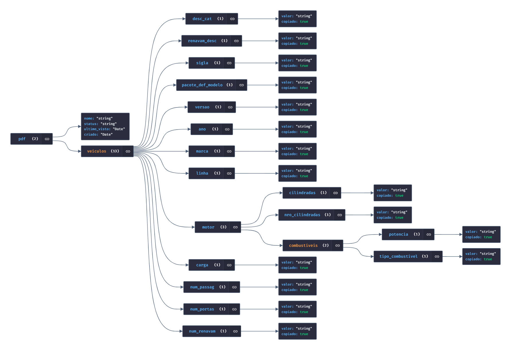

[](home)

# Documentação do negócio
[](sprints)
[](requisitos)
[](processos)
[](gerencia)
[](horarios)
[](squads)

# Documentação técnica
[](arquitetura)
[](mockups)
[](banco_dados)
[](instalacao)

---
# $`\mathbb{BANCO \space DE \space DADOS}`$
---


---

### $`\sf Estrutura \space do \space banco \space em \space JSON`$

```json
{
  "pdf": {
    "nome": "string",
    "status": "string",
    "ultimo_visto": "Date",
    "criado": "Date",
    "veiculos": [
      {
        "desc_cat": {
          "valor": "string",
          "copiado": true
        },
        "renavam_desc": {
          "valor": "string",
          "copiado": true
        },
        "sigla": {
          "valor": "string",
          "copiado": true
        },
        "pacote_def_modelo": {
          "valor": "string",
          "copiado": true
        },
        "versao": {
          "valor": "string",
          "copiado": true
        },
        "ano": {
          "valor": "string",
          "copiado": true
        },
        "marca": {
          "valor": "string",
          "copiado": true
        },
        "linha": {
          "valor": "string",
          "copiado": true
        },
        "motor": {
          "cilindradas": {
            "valor": "string",
            "copiado": true
          },
          "nro_cilindradas": {
            "valor": "string",
            "copiado": true
          },
          "combustiveis": [
            {
              "potencia": {
                "valor": "string",
                "copiado": true
              },
              "tipo_combustivel": {
                "valor": "string",
                "copiado": true
              }
            }
          ]
        },
        "carga": {
          "valor": "string",
          "copiado": true
        },
        "num_passag": {
          "valor": "string",
          "copiado": true
        },
        "num_portas": {
          "valor": "string",
          "copiado": true
        },
        "num_renavam": {
          "valor": "string",
          "copiado": true
        }
      }
    ]
  }
}
```

---

### $`\sf Diagrama \space do \space Banco \space de \space Dados`$

- Diagrama pode ser visualizado com o código JSON no site [JSON CRACK](https://jsoncrack.com/editor)


