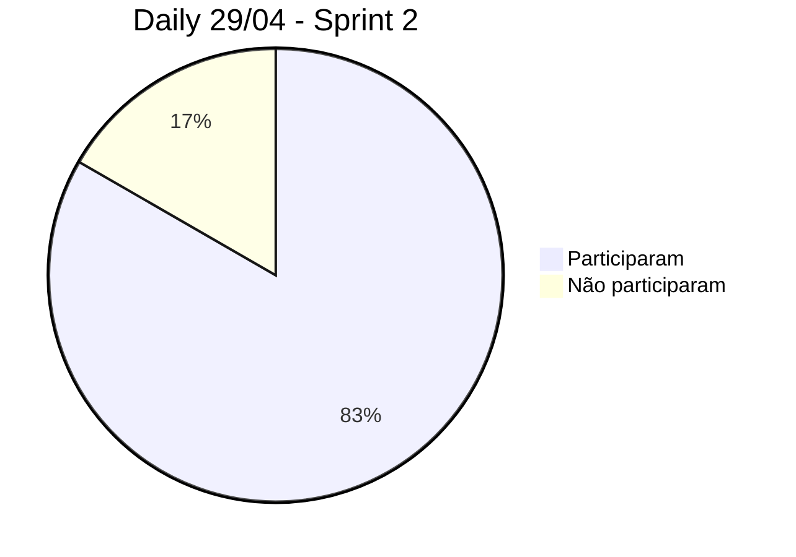

# Documentação do negócio

# Documentação técnica

---

# $`\mathbb{ORGANIZAÇÃO \space DAS \space SQUADS}`$

---

- [SQUAD DO DAVID](#squad-do-david)
- [SQUAD DO FANTO](#squad-do-fanto)
    - [Sprint 2](#sprint-2)
        - [Equipe](#equipe)
        - [Organização](#organização)
        - [Horários da Squad](#horários-da-squad)
        - [Participantes Daily do Sábado](#participantes-dailys-do-sábado)
- [SQUAD DO LUIZ](#squad-do-luiz)

---

## SQUAD DO DAVID

---

## SQUAD DO FANTO

### Sprint 2

- Foi iniciado oficialmente as Squads na Sprint 2 do Projeto

#### Equipe

Nome | Nível AGES | Função Sprint 2
|---|---|---|
|Felipe Freitas|I|Responsável secundário no Frontend
|Gabriel Giaretta|I|Responsável primário no Backend
|Israel Garcia|II|Responsável secundário no Backend Auxiliar Gabriel Giaretta
|Marcello Marcon|II|Responsável primário no Frontend Auxiliar Felipe Freitas
|Arthur Ibarra|III|Arquiteto e responsável no auxilio do desenvolvimento
|Gabriel Fanto|IV|Gerente e reponsável na gerencia e auxilio de toda a Squad

**Primário** significa que a pessoa é responsável de atualizar a tarefa no Trello e ser o desenvolvedor da tarefa

**Secundário** significa que deve dar auxilio ao desenvolvedor primário e deve documentar o processo do desenvolvimento.

#### Organização

- Daily da Squad ocorre todos os Sábados as 15h.
- Foi estimado as tarefas utilizando o `Planning Poker` com o seguinte sistema de Fibonnaci:

Carta|Descrição|Explicação
|---|---|---|
1|Trivial|Super fácil e sei fazer.
2|Confortável|Fácil, mas preciso validar se é fácil mesmo.
3|Rotina|Sei fazer mas preciso de ajuda.
5|Acho que não é dificil|Não sei fazer mas me parece simples.
8|Desafiador|Falta de conhecimento e devo ter que estudar como fazer.
13|Intimidador|Dificil por experiência ou por não ter vivencia no assunto.
?|Dúvida|Não entendi e preciso tirar umas dúvidas sobre.

- A estimativa definida pela equipe pelas seguintes tarefas:

Tarefa|Pontos
|---|---|
[[E02-US01] Tast 09 - Status das extrações](https://trello.com/c/pgYjm99l)|3 Pontos
[[E02-US02] Task 11 - Extração tabela modelos](https://trello.com/c/RCpXI6LB)| 6 Pontos (entre Acho que não é dificil e Desafiador)
[[E02-US02] Task 12 - Tabela Especificação Técnica](https://trello.com/c/IzChMXZC)| 8 Pontos

- As tarefas foram divididas da seguinte forma

Responsáveis|Tarefa
|---|---|
Gabriel Giaretta (Primário) Israel Garcia (Secundário)|[[E02-US02] Task 11 - Extração tabela modelos](https://trello.com/c/RCpXI6LB)
Marcello Marcon (Primário) Felipe Freitas (Secundário)|[[E02-US01] Tast 09 - Status das extrações](https://trello.com/c/pgYjm99l)
Gabriel Giaretta (Primário) Israel Garcia (Secundário)|[[E02-US02] Task 12 - Tabela Especificação Técnica](https://trello.com/c/IzChMXZC)

#### Horários da Squad

Quinta-Feira

| Horários | Felipe Freitas | Gabriel Giaretta | Israel Garcia | Marcello Marcon | Arthur Ibarra | Gabriel Fanto
| --- | --- | --- | --- | --- | --- | --- |
| 08:00 | |  ✅ | | | |
| 09:00 | |  ✅ | | | |
| 10:00 | |  ✅ | | | |
| 11:00 | |  ✅ | | | |
| 12:00 | |  | | | |
| 13:00 | | ✅ | | | |
| 14:00 | | ✅ | | | |
| 15:00 | | ✅ | | | |
| 16:00 | | ✅ | | | |
| 17:00 | | ✅ | | | |
| 18:00 | | | | | ✅ |
| 19:00 | | | | | ✅ |
| 20:00 | | | | | ✅ |
| 21:00 | | | | | ✅ |
| 22:00 | ✅ | ✅ | ✅ | ✅ | ✅ | ✅ | 
| 23:00 | ✅ | ✅ | ✅ | ✅ | | ✅ | 
| 00:00 | ✅ | ✅ | ✅ | ✅ | | ✅ | 

Sexta-Feira

| Horários | Felipe Freitas | Gabriel Giaretta | Israel Garcia | Marcello Marcon | Arthur Ibarra | Gabriel Fanto
| --- | --- | --- | --- | --- | --- | --- |
| 08:00 | |  ✅ | | | |
| 09:00 | |  ✅ | | | |
| 10:00 | |  ✅ | | | |
| 11:00 | |  ✅ | | | |
| 12:00 | | | | | |
| 13:00 | | ✅ | | | |
| 14:00 | | ✅ | | | |
| 15:00 | | ✅ | | | |
| 16:00 | | ✅ | ✅ | | |
| 17:00 | | ✅ | ✅ | | |
| 18:00 | | ✅ | ✅ | | |
| 19:00 | | ✅ | ✅ | | |
| 20:00 | | ✅ | | | |
| 21:00 | | ✅ | | | |
| 22:00 | ✅ | ✅ | ✅ | ✅ | | ✅ | 
| 23:00 | ✅ | ✅ | ✅ | ✅ | ✅ | ✅ | 
| 00:00 | ✅ | ✅ | ✅ | ✅ | ✅ | ✅ | 

Sábado

| Horários | Felipe Freitas | Gabriel Giaretta | Israel Garcia | Marcello Marcon | Arthur Ibarra | Gabriel Fanto
| --- | --- | --- | --- | --- | --- | --- |
| 08:00 | ✅ | | ✅ | ✅ | |
| 09:00 | ✅ | | ✅ | ✅ | |
| 10:00 | ✅ | | ✅ | ✅ | |
| 11:00 | ✅ | | ✅ | ✅ | |
| 12:00 | ✅ | | | | |
| 13:00 | ✅ | ✅ | ✅ | ✅ | ✅ |
| 14:00 | ✅ | ✅ | ✅ | ✅ | ✅ |
| 15:00 | ✅ | ✅ | ✅ | ✅ | ✅ |
| 16:00 | ✅ | ✅ | ✅ | ✅ | ✅ |
| 17:00 | ✅ | ✅ | ✅ | ✅ | ✅ |
| 18:00 | ✅ | ✅ | | ✅ | ✅ | ✅ 
| 19:00 | ✅ | ✅ | | ✅ | ✅ | ✅ 
| 20:00 | ✅ | ✅ | | ✅ | ✅ | ✅ 
| 21:00 | ✅ | ✅ | | ✅ | ✅ | ✅ 
| 22:00 | ✅ | ✅ | ✅ | | ✅ | ✅  
| 23:00 | ✅ | ✅ | ✅ | | ✅ | ✅  
| 00:00 | ✅ | ✅ | ✅ | | ✅ | ✅ 

#### Participantes Dailys do Sábado

* 22/04 era feriado e não nos reunimos para fazer daily síncrona.

---

## SQUAD DO LUIZ

### Sprint 2

- Foi iniciado oficialmente as Squads na Sprint 2 do Projeto

#### Equipe

Nome | Nível AGES | Função Sprint 2
|---|---|---|
|Carolina Ferreira|I|Responsável primário no Frontend
|Mateus Caçabuena|I|Responsável primário no Frontend
|Gabriel Ferreira|I|Responsável primário no Frontend
|Arthur Mariano|II|Responsável secundário no Frontend Auxiliar os AGES I
|Kevin Ribas|III|Arquiteto e responsável no auxilio do desenvolvimento
|Luiz Eduardo|IV|Gerente e responsável na micro-gerência e auxilio de toda a Squad

**Primário** significa que a pessoa é responsável de atualizar a tarefa no Trello e ser o desenvolvedor da tarefa

**Secundário** significa que deve dar auxilio ao desenvolvedor primário e deve documentar o processo do desenvolvimento.

#### Organização

- Combinamos uma reunião semanal para desenvolvermos juntos e atualizarmos o andamento das tasks individuais (Todas as sextas a partir das 20h:30
, ou fins de semana caso haja excessões)
- Foi estimado as tarefas utilizando o `Planning Poker` com o seguinte sistema de Fibonnaci:

Carta|Descrição|Explicação
|---|---|---|
1|Trivial|Super fácil e sei fazer.
2|Confortável|Fácil, mas preciso validar se é fácil mesmo.
3|Rotina|Sei fazer mas preciso de ajuda.
5|Acho que não é dificil|Não sei fazer mas me parece simples.
8|Desafiador|Falta de conhecimento e devo ter que estudar como fazer.
13|Intimidador|Dificil por experiência ou por não ter vivencia no assunto.
?|Dúvida|Não entendi e preciso tirar umas dúvidas sobre.

- A estimativa definida pela equipe pelas seguintes tarefas:

Tarefa|Pontos
|---|---|
[[E01-US01] Task 03 - Envio de Múltiplos PDF](https://trello.com/c/zl6UQeD2)|3 Pontos
[[E01-US02] Task 05 - Lista de PDFS enviados](https://trello.com/c/mWGKO8BM)| 8 Pontos
[[E01-US02] Task 00 - Dropdown/Select das montadoras](https://trello.com/c/8CPHS1Iy)| 5 Pontos
[[E01-US03] Task 06 - Montadora do PDF](https://trello.com/c/vfuHxOie)| 8 Pontos
[[E02-US03] Task 08 - Preparação para a extração - BACKEND](https://trello.com/c/h1485RzR)| 8 Pontos

- As tarefas foram divididas da seguinte forma:

Tarefa|Responsável primário|Responsável secundário
|---|---|---|
[[E01-US01] Task 03 - Envio de Múltiplos PDF](https://trello.com/c/zl6UQeD2)|Carolina Ferreira| Kevin Ribas
[[E01-US02] Task 05 - Lista de PDFS enviados](https://trello.com/c/mWGKO8BM)|Gabriel Ferreira| Arthur Mariano
[[E01-US02] Task 00 - Dropdown/Select das montadoras](https://trello.com/c/8CPHS1Iy)|Carolina Ferreira| Arthur Mariano
[[E01-US03] Task 06 - Montadora do PDF](https://trello.com/c/vfuHxOie)|Mateus Caçabuena| Arthur Mariano
[[E02-US03] Task 08 - Preparação para a extração - BACKEND](https://trello.com/c/h1485RzR)|Mateus Caçabuena| Arthur Mariano